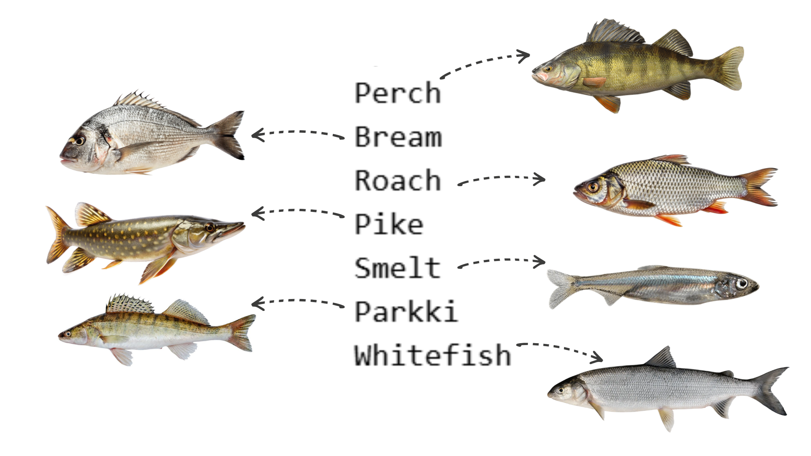
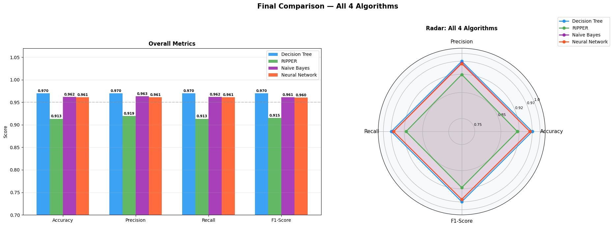
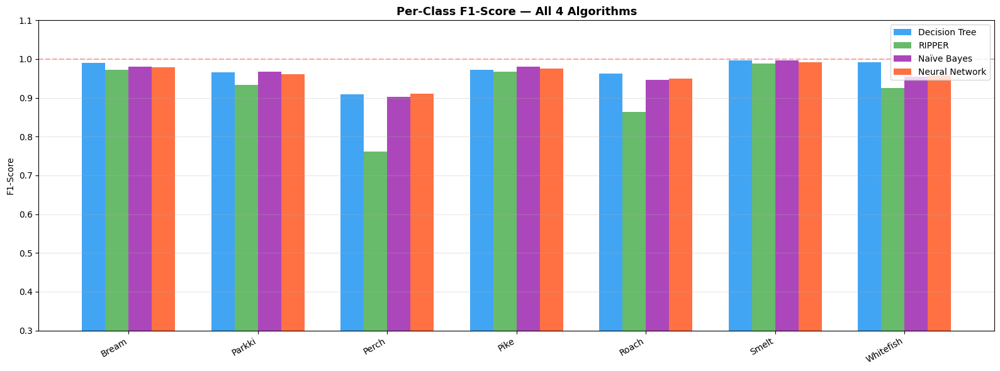

# Fish Species Classification

Can a fish be identified purely from its physical measurements, no images, no DNA, 
just numbers? This project puts that question to the test. Using weight, length, 
height, and width data from 7,159 fish samples across 7 species, four classifiers 
were trained and compared to see which best separates species that are often 
difficult to tell apart.



---

## Dataset

- **Name:** Fisheries Dataset: Fish Species Classification and Attribute Analysis
- **Source:** [Mendeley Data](https://data.mendeley.com/datasets/bgsx9fjw4d/2)
- **Citation:** Tonk, Anushka; A, SASITHRADEVI; M, Vijayalakshmi (2025), Mendeley Data, V2, doi: 10.17632/bgsx9fjw4d.2
- **Size:** 7,159 samples
- **Classes:** 7 fish species (Bream, Roach, Whitefish, Parkki, Perch, Pike, Smelt)
- **Class Balance:** Well-balanced (~1,006–1,056 samples per species)

### Features

| Feature | Description |
|---|---|
| Weight | Fish weight in grams |
| Length1 | Standard length (cm) |
| Length2 | Fork length (cm) |
| Length3 | Total length (cm) |
| Height | Body height (cm) |
| Width | Body width (cm) |

---

## Results

| Algorithm | Accuracy | Precision | Recall | F1-Score | CV Accuracy |
|---|---|---|---|---|---|
| **Decision Tree** | **97.00%** | **97.00%** | **97.00%** | **96.96%** | 96.63% |
| Naive Bayes | 96.16% | 96.33% | 96.16% | 96.11% | 96.45% |
| Neural Network (MLP) | 96.09% | 96.11% | 96.09% | 96.05% | 96.28% |
| Rule Induction (RIPPER) | 91.34% | 91.93% | 91.34% | 91.54% | - |

### Key Findings

- **Best model:** Decision Tree - highest accuracy across all metrics
- **Worst model:** RIPPER - lowest accuracy, struggles with overlapping species
- **Easiest species:** Smelt - perfectly classified by all models due to its distinctively small size
- **Hardest species:** Perch - overlaps with Roach, Parkki, and Whitefish across all features





---

## Project Structure

```
fish-species-classification/
├── images/
├── Fish.csv
├── README.md
├── fish_classifier.ipynb
└── requirements.txt
```

---

## How to Run
 
### 1. Clone the repository
```bash
git clone https://github.com/Cs-Jimmy/fish-species-classification.git
cd fish-species-classification
```
 
### 2. Install dependencies
```bash
pip install -r requirements.txt  
```
 
### 3. Run the notebook
```bash
jupyter notebook fish_classifier.ipynb
```
 
Or open it directly in VS Code, JupyterLab, or Google Colab.

---

## Collaborators

Built by **Jumanah Rushdi** & **Laila Mohamed** as part of the 
*Forecasting and Predictive Analytics* course.
